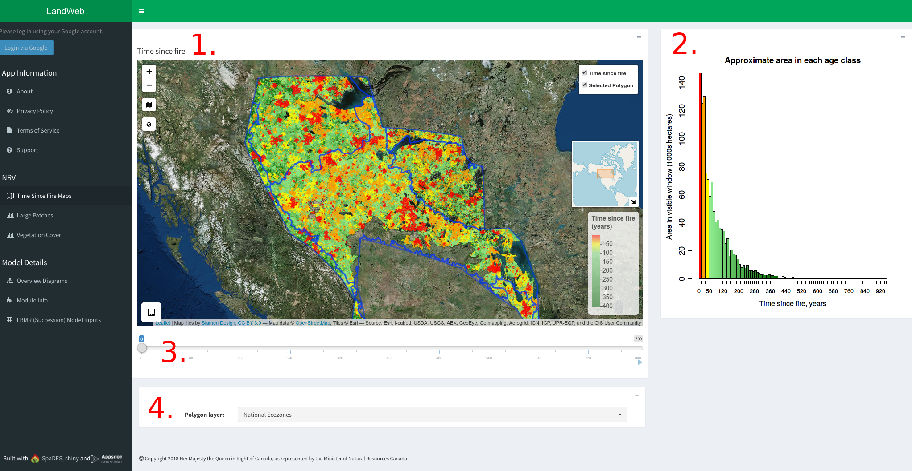
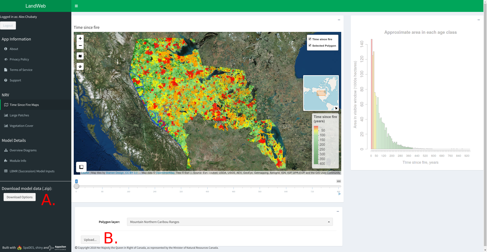
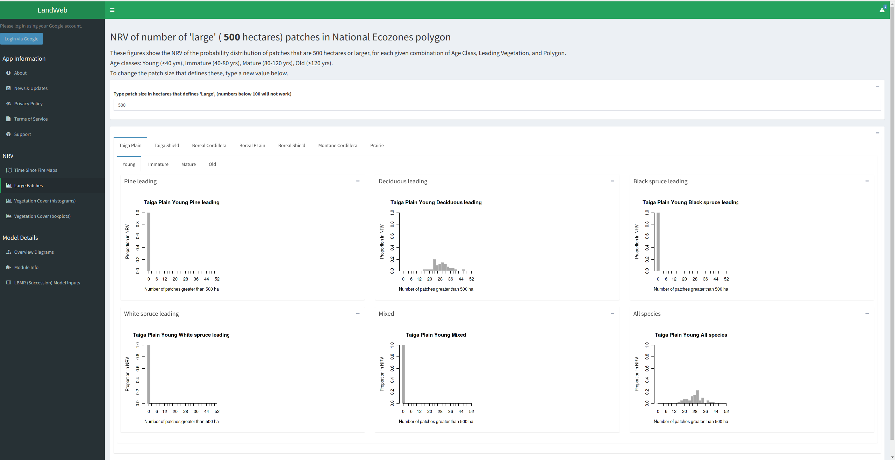
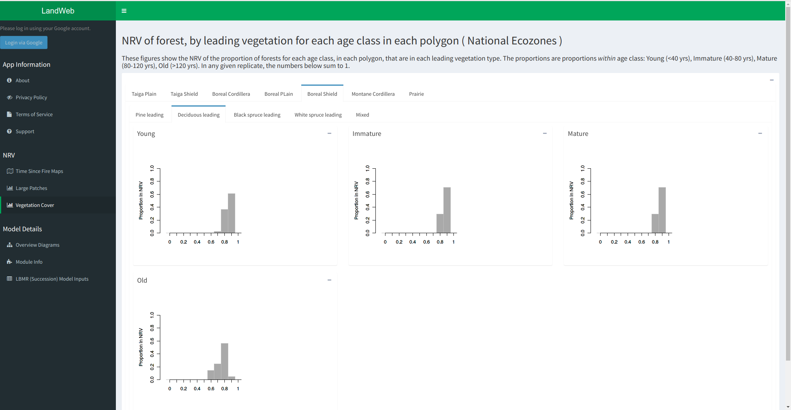
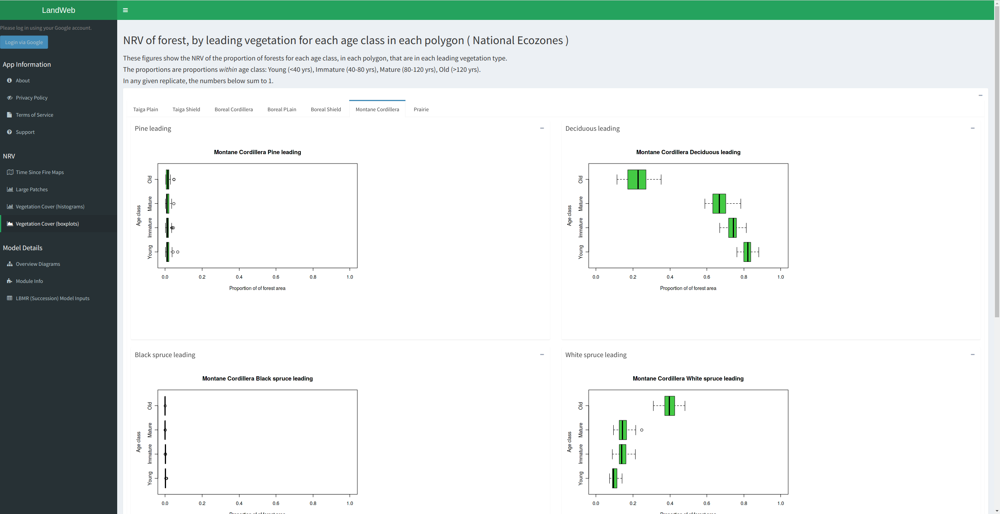

\newpage

# Introduction

The LandWeb app is available from http://landweb.ca.

## About

The LandWeb model integrates two well-used models for forest stand succession and fire simulation, implemented in the `SpaDES` simulation platform (Chubaty & McIntire, 2018).
Vegetation dynamics are modeled using an implementation of the LANDIS-II Biomass Succession model (Scheller & Mladenoff, 2004; Scheller *et al.*, 2007).
Fire dynamics are modeled using an implementation of LandMine (Andison, 1996).

Simulations were run for the entire LandWeb study area, which spans most of the western Canadian boreal forest.
Input data were derived from several publically available remote-sensed datasets (Beaudoin *et al.*, 2014), as well as proprietary data complied by Pickell *et al.*.

Simulation outputs consist of maps showing the time since fire as well as histogram summaries of 1) number of large patches (*i.e.*, patches above the number of hectars specified by the user) contained within the selected spatial area; and 2) the vegetation cover within the selected spatial area.
Histograms are provided for each spatial area by polygon, age class, and species.
Authorized users can additionally overlay current stand conditions onto these histograms.
Simulation outputs are summarized for several publically available reporting polygons (including national ecozones, and ecodistricts) as well as several proprietary spatial areas (authorized users only).
Authorized users can additonally upload their own erporting polygons on which to summarize model results.

## Privacy Statement

See https://friresearch.ca/content/friresearchca-privacy-policy.

## Terms of Service

Before using the app you will be presented with the Terms of Service, which you must accept before proceeding.

The terms of service can be accessed at anytime by selecting  "Terms of Service" from the left-side menu.

\newpage

# Using the Landweb app

Visit http://landweb.ca to get started.

Select pages from the menu on the left-side navigation menu.

- Login using your Google account to access additional features.
- **App Information:** additonal information about the app and model.
- **NRV:** view model results.
- **Model Details:** detailed information regording the model structure and its implementation in `SpaDES`.

## Time since fire maps

This page shows four major components, highlighted in Fig. 1 and described below.



### 1. Time since fire map

This map shows the time since fire at the time of the simulation indicated by the slider (see #3 below), for the spatial area indicated by the selected polygon (see #4 below).
Warmer colours (reds, oranges) indicate the most recent fire events, whereas cooler colours (greens) indicate more time since fire.
The total area corresponding to time since fire (in years) is shown in the time since fire histogram (see #2 below).

As you zoom in/out of the map, the time since fire histogram will update based on the area that is currently visible on the map.

Clicking on different sections of the map will open a popup showing the stats for the area clicked-on.

### 2. Time since fire histogram

This figure shows the total area corresponding to each "age class" (i.e., time since fire).
Warmer colours (reds, oranges) indicate the most recent fire events, whereas cooler colours (greens) indicate more time since fire.

As you zoom in/out of the map, the time since fire histogram will update based on the area that is currently visible on the map.

### 3. Slider

Use this slider to move forward and backward through time in the simulation.
By default, the first map shown corresponds to the beginning of the simulation, with each increment in the slider bar corresponding to 20 years.
To see the results after 1500 years, move the slider to the far right position.

*NOTE: the map and histogram on this page may take a moment to reload after moving the slider position.*

### 4. Polygon selection

Use this dropdown selector to change the polygon highlighted on the map and used to summarive results on the "Large Patches" and "Vegetation Cover" pages.

Changing the polygon also updates the histograms displayed on the "Large Patches" and "Vegetation Cover" pages (see below).

*NOTE: the map and histogram on this page may take a few moments to reload after changing polygons.*

Authorized (logged in) users will have access to additional reporting polygons, and can upload their own using the polygon uploader (Fig. 2).

#### Uploading a custom spatial polygon



Use the "Upload" button to open a file selector that will allow you to upload a custom polygon from your computer (labelled B in Fig. 2).
The uploaded polygon can be either a `.zip` file containing the `.shp` and auxillary files, or the `.shp` (and auxilliary) file themselves.

*NOTE: to select multiple files, hold down the `Ctrl` key during file selection.*

## Large patches histograms



These figures (see Fig. 3) show the NRV of the probability distribution of patches that are larger than the area (in hectares) selected, for each given combination of Age Class, Leading Vegetation, and Polygon.
Use the tabs on this page to examine each combination of these variables.
Age classes are as follows: Young (<40 yrs), Immature (40-80 yrs), Mature (80-120 yrs), Old (>120 yrs).

Authorized (logged in) users will see a red line added to each of these figures, which indicates the current landscape conditions.

To change the patch size that defines these, enter a new value in the box on this page.

*NOTE: the histograms on this page will take some time to load following a change in the patch size, or when selecting a different polygon from the "Time Since Fire Maps" page.*

## Vegetation cover histograms



These figures (see Fig. 4) show the NRV of the proportion of forests for each age class, in each polygon, that are in each leading vegetation type.
Use the tabs on this page to examine each combination of these variables.
The proportions are proportions within age class: Young (<40 yrs), Immature (40-80 yrs), Mature (80-120 yrs), Old (>120 yrs).

In any given replicate, the numbers below sum to 1.

Authorized (logged in) users will see red lines added to the histograms, which indicate the current landscape conditions.

*NOTE: the histograms on this page will take some time to load when selecting a different polygon from the "Time Since Fire Maps" page.*

## Vegetation cover boxplots



These figures (see Fig. 5) show the NRV of the proportion of forests for each age class, in each polygon, that are in each leading vegetation type.
Use the tabs on this page to examine each combination of these variables.
The proportions are proportions within age class: Young (<40 yrs), Immature (40-80 yrs), Mature (80-120 yrs), Old (>120 yrs).

In any given replicate, the numbers below sum to 1.

Authorized (logged in) users will see red dots added to the boxplots, which indicate the current landscape conditions.

*NOTE: the boxplots on this page will take some time to load when selecting a different polygon from the "Time Since Fire Maps" page.*

## Log in using your Google account

By pressing the "Login via Google" button in the left-side menu, authorized users can gain access to additonal features.
During login, you will be presented with the Google authentication screen.
All authentication is performed using OAuth tokens, and at no point does the app see nor record your password.

You can log out at any time by pressing the "Logout" button located in the top left-side menu.

# Model inputs

## Public data sources

Various publically accessible datasets are used as model inputs, including:

- Land Cover Classification 2005 map: ftp://ftp.ccrs.nrcan.gc.ca/ad/NLCCLandCover/LandcoverCanada2005_250m/LandCoverOfCanada2005_V1_4.zip;
- LANDIS-II species traits: https://github.com/dcyr/LANDIS-II_IA_generalUseFiles;
- LANDIS-II parameterization tables and data: https://github.com/LANDIS-II-Foundation/Extensions-Succession-Archive/master/biomass-succession-archive/trunk/tests/v6.0-2.0/;
- Canada biomass, stand volume, and species data (from Beaudoin *et al.*, 2014): http://tree.pfc.forestry.ca;
- National ecodistrict polygons: http://sis.agr.gc.ca/cansis/nsdb/ecostrat/district/ecodistrict_shp.zip;
- National ecoregion polygons: http://sis.agr.gc.ca/cansis/nsdb/ecostrat/region/ecoregion_shp.zip;
- National ecozone polygons: http://sis.agr.gc.ca/cansis/nsdb/ecostrat/zone/ecozone_shp.zip.

## Proprietary data

All proprietary data are stored securely in an access-controlled Google Drive location.
These data include:

- biomass by species maps created by Pickell et al. (UBC) resolution 100m x 100m from LandSat and kNN based on CASFRI;
- reporting polygons used to summarize model results in the app.

# Model outputs

Model outputs are available to download for authorized app users, and are described below.

## Downloading outputs

Authorized (logged in) users have the option to download model outputs.
Click the "Download Options" button (labelled A in Fig. 2) to view download options.

*NOTE: It make some time to produce the `.zip` file for download.*

### Currently Selected Spatial Area

- Currently selected reporting polygon (`.shp`)

### Large Patches Data for study region

- Large Patches Data (`.csv`)
- Large patches histograms (`.png`)

### Leading Vegetation Cover Data for study region

- Leading Vegetation Cover Data (`.csv`)
- Leading Vegetation Cover histograms (`.png`)

### Simulation Rasters (cropped to study region)

- Flammability maps (`.grd`)
- Time Since Fire maps (`.tif`)
- Vegetation type maps (`.grd`, `.tif`)

\newpage

### Additional R Data Files (advanced users)

- Simulation data files (`.RData`, `.rds`)

The downloaded outputs are bundled into a zip file (*e.g.*, `LandWeb_v1.0.0_2018-04-13.zip`) with the following directory and file structure:

```
LandWeb_v1.0.1_2018-08-08/
 |_ boxplots/
     |_ vegAgeMod/
 |_ histograms/
     |_ largePatches/
         |_ 500/                  ## currently selected patchSize
     |_ vegAgeMod/
 |_ polygons/
 |_ rasters/
     |_ rstTimeSinceFire_*.tif
     |_ vegTypeMap_*.tif*
 |_ experiment.RData
 |_ largePatches.csv
 |_ README.md
 |_ simulationOutput_*.rds
 |_ vegArea.csv
```

# Getting help

To get help with the app or the model outputs, select "Support" form the left-side menu.
Please see the Frequently Asked Questions for answers to common queries, or email one of the support contacts listed.

\newpage

# References

Beaudoin, et al. (2014). Mapping attributes of Canada’s forests at moderate resolution through kNN and MODIS imagery. Canadian Journal of Forest Research, 44, 521–532. http://doi.org/10.1139/cjfr-2013-0401. Data available from http://tree.nfis.org/.

Chubaty, A. M. & McIntire, E. J. B. (2018) `SpaDES`: Develop and Run Spatially Explicit Discrete Event Simulation Models. R package version 2.0.1.
https://CRAN.R-project.org/package=SpaDES

Scheller, R. M., & Mladenoff, D. J. (2004). A forest growth and biomass module for a landscape simulation model, LANDIS: Design, validation, and application. Ecological Modelling, 180, 211–229. http://doi.org/10.1016/j.ecolmodel.2004.01.022

Scheller, R. M., Domingo, J. B., Sturtevant, B. R., Williams, J. S., Rudy, A., Gustafson, E. J., & Mladenoff, D. J. (2007). Design, development, and application of LANDIS-II, a spatial landscape simulation model with flexible temporal and spatial resolution. Ecological Modelling, 201, 409–419. http://doi.org/10.1016/j.ecolmodel.2006.10.009
