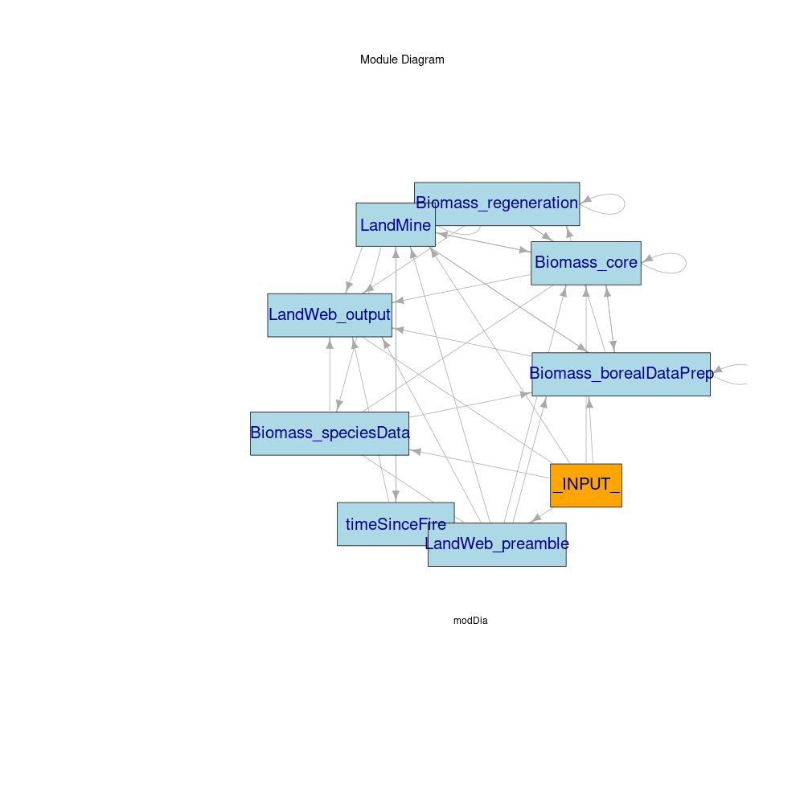

```{r setup, include=FALSE}
library(knitr)
library(magrittr)
library(SpaDES.core)

knitr::opts_chunk$set(echo = TRUE)
```

## LandWeb module details

```{r modules, echo=FALSE, message=FALSE, warning=FALSE}
modulePath <- file.path("../m")
m <- basename(dir(modulePath))

## get module metadata
md1 <- moduleMetadata(module = m[1], path = modulePath) %>% suppressWarnings() ## Biomass_borealDataPrep
md2 <- moduleMetadata(module = m[2], path = modulePath) %>% suppressWarnings() ## Biomass_core
md3 <- moduleMetadata(module = m[3], path = modulePath) %>% suppressWarnings() ## Biomass_regeneration
md4 <- moduleMetadata(module = m[4], path = modulePath) %>% suppressWarnings() ## Biomass_speciesData
md5 <- moduleMetadata(module = m[5], path = modulePath) %>% suppressWarnings() ## LandMine
md6 <- moduleMetadata(module = m[6], path = modulePath) %>% suppressWarnings() ## LandWeb_output
md7 <- moduleMetadata(module = m[7], path = modulePath) %>% suppressWarnings() ## LandWeb_preamble
md8 <- moduleMetadata(module = m[8], path = modulePath) %>% suppressWarnings() ## timeSinceFire
```

### `r m[1]`

#### Required packages

```{r packages1, echo=FALSE}
packages(modules = m[1], paths = modulePath)
```

#### Parameters

```{r params1, echo=FALSE}
kable(md1$parameters)
```

#### Input objects

```{r inputs1, echo=FALSE}
kable(md1$inputObjects)
```

#### Output objects

```{r outputs1, echo=FALSE}
kable(md1$outputObjects)
```

### `r m[2]`

#### Required packages

```{r packages2, echo=FALSE}
packages(modules = m[2], paths = modulePath)
```

#### Parameters

```{r params2, echo=FALSE}
kable(md2$parameters)
```

#### Input objects

```{r inputs2, echo=FALSE}
kable(md2$inputObjects)
```

#### Output objects

```{r outputs2, echo=FALSE}
kable(md2$outputObjects)
```

### `r m[3]`

#### Required packages

```{r packages3, echo=FALSE}
packages(modules = m[3], paths = modulePath)
```

#### Parameters

```{r params3, echo=FALSE}
kable(md3$parameters)
```

#### Input objects

```{r inputs3, echo=FALSE}
kable(md3$inputObjects)
```

#### Output objects

```{r outputs3, echo=FALSE}
kable(md3$outputObjects)
```

### `r m[4]`

#### Required packages

```{r packages4, echo=FALSE}
packages(modules = m[4], paths = modulePath)
```

#### Parameters

```{r params4, echo=FALSE}
kable(md4$parameters)
```

#### Input objects

```{r inputs4, echo=FALSE}
kable(md4$inputObjects)
```

#### Output objects

```{r outputs4, echo=FALSE}
kable(md4$outputObjects)
```

### `r m[5]`

#### Required packages

```{r packages5, echo=FALSE}
packages(modules = m[5], paths = modulePath)
```

#### Parameters

```{r params5, echo=FALSE}
kable(md5$parameters)
```

#### Input objects

```{r inputs5, echo=FALSE}
kable(md5$inputObjects)
```

#### Output objects

```{r outputs5, echo=FALSE}
kable(md5$outputObjects)
```

### `r m[6]`

#### Required packages

```{r packages6, echo=FALSE}
packages(modules = m[6], paths = modulePath)
```

#### Parameters

```{r params6, echo=FALSE}
kable(md6$parameters)
```

#### Input objects

```{r inputs6, echo=FALSE}
kable(md6$inputObjects)
```

#### Output objects

```{r outputs6, echo=FALSE}
kable(md6$outputObjects)
```

### `r m[7]`

#### Required packages

```{r packages7, echo=FALSE}
packages(modules = m[7], paths = modulePath)
```

#### Parameters

```{r params7, echo=FALSE}
kable(md7$parameters)
```

#### Input objects

```{r inputs7, echo=FALSE}
kable(md7$inputObjects)
```

#### Output objects

```{r outputs7, echo=FALSE}
kable(md7$outputObjects)
```

### `r m[8]`

#### Required packages

```{r packages8, echo=FALSE}
packages(modules = m[8], paths = modulePath)
```

#### Parameters

```{r params8, echo=FALSE}
kable(md8$parameters)
```

#### Input objects

```{r inputs8, echo=FALSE}
kable(md8$inputObjects)
```

#### Output objects

```{r outputs8, echo=FALSE}
kable(md8$outputObjects)
```

## LandWeb module integration

```{r eval=FALSE}
library(SpaDES.core)
library(LandWebUtils)

fsim <- simFile("mySim_landweb", "docs", 0)
mySim_landweb <- if (!file.exists(fsim)) {
  modules_landweb <- c("LandWeb_preamble", "Biomass_speciesData", "Biomass_core", "LandMine",
                       "Biomass_regeneration", "LandWeb_output",  "timeSinceFire")
  Cache(simInit,
        times = times3,
        params = parameters3,
        modules = modules_landweb,
        outputs = outputs3,
        objects = objects3,
        paths = paths3,
        loadOrder = unlist(modules_landweb),
        omitArgs = c("debug", "paths", ".plotInitialTime")
  )
  saveSimList(mySim_landweb, fsim)
} else {
  loadSimList(fsim)
}

png(file.path("docs", "LandWeb_module_diagram.png"), height = 1800, width = 3200)
  moduleDiagram(mySim_landweb)
dev.off()

## currently not working: see https://github.com/rich-iannone/DiagrammeR/issues/207
## workaround is to use Rstudio's manual export ability :S
objectDiagram(mySim_landweb, height = 2500, width = 1250) #%>%
#  DiagrammeRsvg::export_svg() %>%
#  charToRaw() %>%
#  rsvg::rsvg() %>%
#  png::writePNG(file.path("docs", "LandWeb_object_diagram.png"))
```




